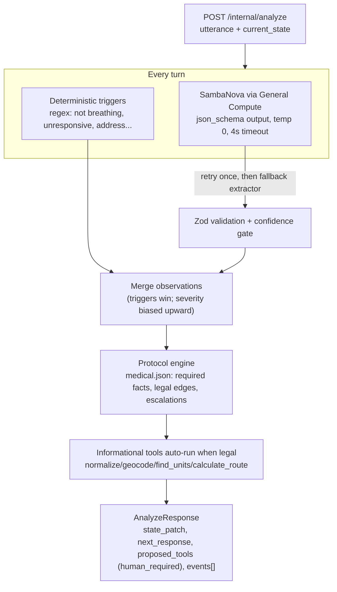

# AURA Intelligence Service

Pranay's slice of AURA: the emergency-intelligence backend (`services/intelligence` in the team repo). It turns each finalized caller utterance plus the current incident state into a validated incident update, using **SambaNova inference hosted by General Compute** for structured extraction and a **deterministic protocol state machine** for every decision that matters.

> Hackathon simulation only. Nothing here dispatches real responders; every consequential action stops at a human-approval gate.

## How it works



Design rule: **the model observes, the protocol decides.** The model returns facts, a location string, category/priority suggestions and two clinical signals (conscious, breathing). It never names a protocol step, a tool or a dispatch action. Steps, questions, escalations and tool legality live in `src/protocol/*.json`.

## Quick start

```bash
cp .env.example .env            # add GENERALCOMPUTE_API_KEY
npm install
npm run check-model             # lists GC models + one smoke extraction with latency
npm run dev                     # http://localhost:8082
npm run demo                    # scripted 4-turn medical call, offline mock model
npm run demo:live               # same conversation through SambaNova / General Compute
npm test                        # 73 unit + route tests (offline)
npm run test:live               # live smoke test (needs key)
```

Without a key the service starts with a deterministic mock model (`USE_MOCK_MODEL` is implied), so the whole pipeline still runs for the frontend.

### Environment

| Variable | Default | Purpose |
| --- | --- | --- |
| `GENERALCOMPUTE_API_KEY` | - | Bearer key for `https://api.generalcompute.com/v1` |
| `GC_BASE_URL` | `https://api.generalcompute.com/v1` | OpenAI-compatible base URL |
| `GC_MODEL` | `minimax-m2.7` | Model id; `npm run check-model` lists what is live (`gpt-oss-120b` and `deepseek-v3.2` are known-good alternatives) |
| `MODEL_TIMEOUT_MS` | `4000` | Per-call timeout; then one retry, then deterministic fallback |
| `MODEL_MAX_TOKENS` | `600` | Output cap for the extraction JSON |
| `CONFIDENCE_THRESHOLD` | `0.5` | Model output below this is ignored (triggers still apply) |
| `USE_MOCK_MODEL` | `false` (auto `true` without a key) | Offline canned model |
| `PORT` / `HOST` / `LOG_LEVEL` | `8082` / `0.0.0.0` / `info` | Server |

## Endpoints

### `POST /internal/analyze`

Request (from `sambanova.md`; `current_state` may be `{}` on the first turn and should be the previous response's `state` afterwards):

```json
{
  "session_id": "call_001",
  "utterance": "Wait, he stopped breathing",
  "current_state": { "...": "previous response.state" },
  "conversation_summary": "Adult caller reports chest pain at verified address."
}
```

Response: the contract fields from `sambanova.md` plus additive integration fields.

| Field | Meaning |
| --- | --- |
| `state_patch` | Only what changed: `priority`, `facts_added`, `unverified_facts_added`, `facts_verified`, `hazards_added`, `location`, `assessment`, `protocol`, `recommended_services`, `response_plan`, `human_required`, ... |
| `protocol_transition` | `{ protocol_id, from, to, reason, escalation }` or `null` |
| `next_response` | The approved prompt AURA should speak (from protocol templates only) |
| `proposed_tools` | Consequential actions awaiting approval, always `human_required: true` |
| `confidence` | Turn confidence |
| `state` (additive) | Full post-turn `IncidentState`; **source of truth, round-trip it as `current_state`** |
| `events` (additive) | Pre-built envelopes: `tool.started`, `tool.completed`, `protocol.changed`, `dispatch.proposed`, `incident.updated` (always last) |
| `executed_tools` (additive) | Informational tools that ran this turn with results |
| `explanation` (additive) | One dispatcher-facing sentence |
| `meta` (additive) | `model`, `model_latency_ms`, `source` (`model` / `mock` / `fallback`), `validation` (`ok` / `retried` / `fallback` / `low_confidence`), `triggers_matched`, `rejected`, `total_latency_ms` |

Example (turn 4 of the demo, abbreviated):

```json
{
  "state_patch": { "priority": "critical", "status": "awaiting_approval", "facts_added": ["not breathing"], "human_required": true, "protocol": { "id": "MED_CARDIAC_01", "step": "human_dispatch_approval" } },
  "protocol_transition": { "protocol_id": "MED_CARDIAC_01", "from": "breathing_check", "to": "human_dispatch_approval", "reason": "Caller reports patient is not breathing", "escalation": true },
  "next_response": "I understand. Stay on the line while I alert the emergency dispatcher.",
  "proposed_tools": [
    { "name": "create_cad_draft", "arguments": {}, "human_required": true, "reason": "Dispatch EMS (M-20) to 170 St Germain Ave, San Francisco, CA 94114" },
    { "name": "request_specialist", "arguments": { "type": "cpr_instructions", "reason": "..." }, "human_required": true, "reason": "..." }
  ],
  "executed_tools": [{ "name": "find_available_units", "result_summary": "3 EMS unit(s) available; closest M-20 ~4 min" }, { "name": "calculate_route", "result_summary": "M-20: 1.26 km, ETA 4 min" }],
  "confidence": 0.97
}
```

### `POST /internal/tools/execute`

Runs a tool. Informational tools run freely. Consequential tools (`create_cad_draft`, `request_specialist`) return **403 `human_approval_required`** unless `approved: true`; the gateway sets that only after `approval.resolved`. Tools not allowed at the current protocol step return **409 `illegal_at_step`**.

```json
{ "session_id": "call_001", "tool": { "name": "create_cad_draft", "arguments": {} }, "current_state": { "...": "" }, "approved": true, "reviewer": "dispatcher_1" }
```

Returns `{ execution, state_patch, state, events }`. After an approved `create_cad_draft` the state becomes `status: "dispatched"`, `human_required: false`, `response_plan.cad_id` set.

### `GET /internal/health`

Model configuration, mock flag and loaded protocols. Add `?probe=1` to hit `GET /v1/models` on General Compute and report reachability / whether `GC_MODEL` is served.

## Incident state

Canonical fields from `master_plan.md` (`session_id`, `category`, `priority`, `status`, `location{raw,normalized,latitude,longitude,confidence,verified}`, `people_at_risk`, `facts`, `hazards`, `missing_fields`, `protocol{id,step}`, `recommended_services`, `confidence`, `human_required`) plus additive fields:

- `unverified_facts`: model-only facts until a second mention or a trigger corroborates them (`facts` holds verified ones)
- `assessment`: `chief_complaint`, `conscious` (`yes|no|unknown`), `breathing` (`normal|labored|no|unknown`), `hazards_checked`
- `protocol.asked`, `protocol.last_prompt`: which approved questions were asked, so short answers ("no") are interpreted correctly
- `response_plan`: prepared units + route awaiting approval; `cad_id` once dispatched
- `summary`, `updated_at`

## Protocol (`src/protocol/medical.json`)

`MED_CARDIAC_01`: `verify_location -> identify_problem -> conscious_check -> breathing_check -> collect_hazards -> prepare_response -> human_dispatch_approval`

Each step declares `required` predicates, `allowed_next`, `legal_tools`, approved `prompts` (with `when` conditions and `{{placeholders}}`), and whether it must be `confirm`ed (asked before it counts as complete). Escalations are the only way to skip steps and only move forward:

| Signal | Effect |
| --- | --- |
| `breathing = no` | priority `critical`, jump to `human_dispatch_approval`, EMS, fact "not breathing", propose `request_specialist(cpr_instructions)` |
| `conscious = no` | priority `critical`, jump to `breathing_check`, EMS |
| `breathing = labored` | priority at least `high`, EMS |

`GENERAL_INTAKE_01` handles unclassified / fire / police calls (address, problem, human hand-off). Adding a real fire or police protocol is a new JSON file registered in `src/protocol/registry.ts`; definitions are validated at load time (dangling step references fail fast).

## Tool policy

| Tool | Kind | Runs |
| --- | --- | --- |
| `normalize_address`, `geocode_address` | informational | automatically whenever an unverified address is present |
| `find_available_units`, `calculate_route` | informational | automatically at `prepare_response` / `human_dispatch_approval` once the location is verified; emits `dispatch.proposed` |
| `create_cad_draft`, `request_specialist` | consequential | only via `/internal/tools/execute` with `approved: true` |

All results are deterministic sample data around San Francisco (`170 St Germain Ave` geocodes to `37.754, -122.452`; fixed EMS/FIRE/POLICE roster; street-like polylines with ETA).

## Reliability rules

- Every model reply is validated against the Zod schema (`src/schemas/model-output.ts`, also sent as `response_format.json_schema`); unknown keys are stripped, enums enforced.
- Timeout 4 s, one retry with the validation errors attached, then deterministic regex fallback (`meta.source = "fallback"`).
- Model confidence below `CONFIDENCE_THRESHOLD` is ignored; deterministic triggers still apply, so "he stopped breathing" always escalates within the turn.
- Priority is monotonic within a call; model downgrades and category flips are rejected (listed in `meta.rejected`).
- A model "not breathing" that contradicts an explicit trigger needs confidence >= 0.8.
- Protocol transitions are checked against `allowed_next` / forward escalation edges; anything else is logged and refused.
- Latency and validation outcome are logged per turn (`analyze turn complete`).

## Integration notes (Shresth)

1. **State round-trip**: persist `response.state` per session and send it back as `current_state`. The patch is for animation/diffing; the state is authoritative.
2. **Events**: `response.events` already use the shared envelope. Re-stamp `sequence` with the session-wide counter before broadcasting; `event_id` and `timestamp` can be kept.
3. **Approval flow**: on `dispatch.proposed` raise `approval.requested`; on approval call `POST /internal/tools/execute` with the proposal's `name`/`arguments`, `approved: true`, `reviewer`, and the current state. Broadcast the returned `events` and store the returned `state`.
4. **Degraded mode**: `meta.source === "fallback"` on consecutive turns means the model is unreachable; emit `system.degraded` with `failed_dependency: "general_compute"`. The conversation still progresses deterministically.
5. **Speech**: `next_response` is the only text to hand to Aditya's `/internal/speak`.
6. Default port `8082`; drop this directory into `aura/services/intelligence/`.

## Layout

```text
src/
  index.ts              Fastify bootstrap, model client selection
  config.ts             env parsing
  schemas/              incident state, analyze contract, model output schema, event envelope
  protocol/             medical.json, general_intake.json, definition (validation), machine, registry
  engine/               triggers, observations merge, analyzer, patch diff/apply
  model/                General Compute client (openai SDK), prompts, fallback extractor, mock
  tools/                gis (normalize/geocode/route), units, cad, registry + policy
  routes/               /internal/analyze, /internal/tools/execute, /internal/health
  scenario.ts           scripted demo conversation + expectations (shared by script and tests)
scripts/                check-model.ts, scripted-conversation.ts
test/                   machine, triggers, fallback, tools, analyzer, routes, live (skipped without key)
```
